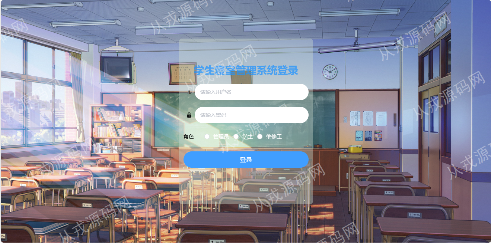
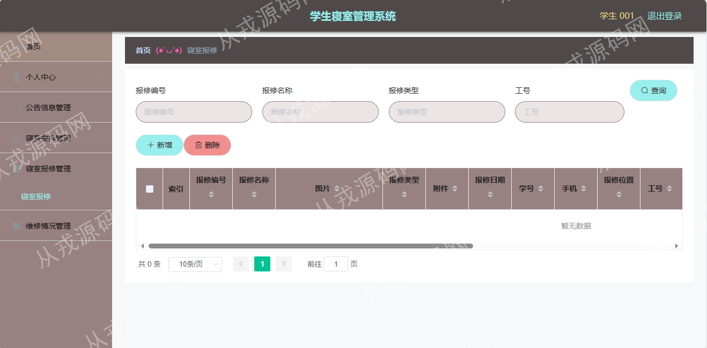
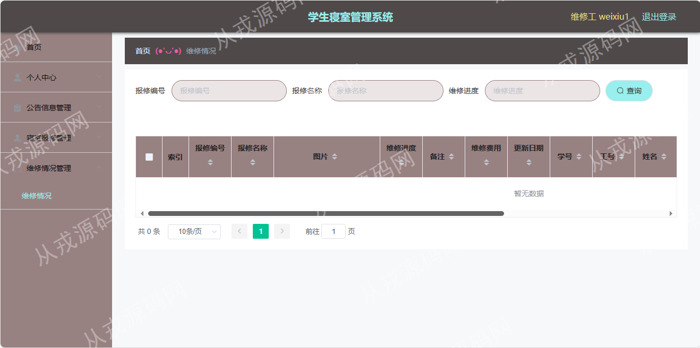

<h1 align="center">63.学生寝室管理系统</h1>

- <b>完整代码获取地址：从戎源码网 ([https://armycodes.com/](https://armycodes.com/))</b>
- <b>技术探讨、资料分享，请加QQ群：692619798</b> 
- <b>作者微信：19941326836  QQ：952045282</b> 
- <b>承接计算机毕业设计、Java毕业设计、Python毕业设计、深度学习、机器学习</b>
- <b>选题+开题报告+任务书+程序定制+安装调试+论文+答辩ppt 一条龙服务</b>
- <b>所有选题地址 ([https://github.com/YuLin-Coder/AllProjectCatalog](https://github.com/YuLin-Coder/AllProjectCatalog)) </b>

## 项目介绍
基于ssm的学生寝室管理系统：前端vue、elementui，后端 maven、springmvc、spring、mybatis，集成公告信息管理、寝室信息管理、学生管理、寝室安排、寝室报修维修等功能于一体的系统。

## 功能介绍

### 管理员

- 个人中心：密码修改，个人信息查看与修改
- 公告信息管理：公告信息的增删改查，图片上传，内容富文本编辑
- 寝室管理：寝室信息的增删改查，寝室图片上传
- 学生信息管理：学生信息的增删改查
- 寝室安排：寝室安排记录列表查询，多条件查询，记录删除，信息修改，查看详情
- 维修工管理：维修工信息的增删改查，设置密码可以在系统中登录
- 寝室报修管理：报修记录查询，多条件查询，记录内容修改和删除，附件下载
- 维修情况管理：维修记录查询，多条件查询，记录内容修改和删除
- 管理员管理：管理员信息的增删改查，设置密码可以在系统中登录

### 学生

- 个人中心：密码修改，个人信息查看与修改
- 公告查询：公告列表，公告详情
- 寝室安排：寝室安排记录查询，多条件查询
- 寝室报修管理：报修信息的增删改查，支持附件上传，可以选择对应的维修工维修
- 维修情况：维修记录查询，跟踪维修进度

### 维修工

- 个人中心：密码修改，个人信息查看与修改
- 公告查询：公告列表，公告详情
- 寝室报修管理：报修记录查询，多条件查询，附件下载
- 维修情况：维修记录查询，跟踪维修进度

## 环境

- <b>IntelliJ IDEA 2021.3</b>

- <b>Mysql 5.7.26</b>

- <b>Tomcat 7.0.73</b>

- <b>JDK 1.8</b>

- <b>node v14.14.0</b>

## 运行截图

